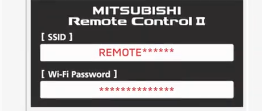
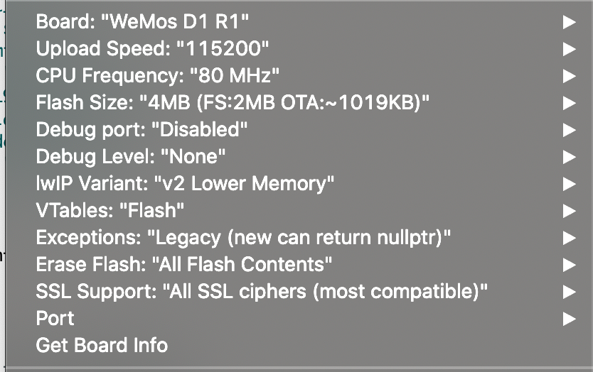
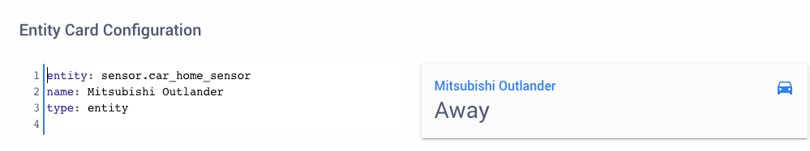

# Home Assistant Mitsubishi Outlander PHEV Detector

This is essentially a WiFi scanner that will look for my car's WiFi access point and update [Home Assistant](https://home-assistant.io) with a status of 'home' or 'away'.

Enjoying this? Help me out with a :beers: or :coffee:!

## Prerequisites ##

**Software**
* [Arduino IDE](https://www.arduino.cc/en/main/software) - I'm using v1.8.12
* Arduino JSON - v6.15.1
* PubSubClient - v2.7.0
* ESP8266WiFi
* ArduinoOTA

**Hardware**

* Either the [Wemos D1 Mini](https://docs.wemos.cc/en/latest/d1/d1_mini.html) or, if you need better range a [Wemos D1 Mini Pro with Antenna](https://escapequotes.net/esp8266-d1-mini-pro-extenal-antenna/)
* A Micro USB to USB cable.

## Setup ##

Once you have setup your hardware and software, you now need to download this project, by clicking `clone -> Download ZIP`.

Unzip the file and navigate to the contents. you should see a file named `My_Helper_sample.h`, go ahead and rename it to `My_Helper.h`.

Now open `outlander_detector.ino`. Doing so should open it in the [Arduino IDE](https://www.arduino.cc/en/main/software).

You do not need to make any changes to the `outlander_detector` script itself!

Click on the `My_Helper.h` tab, that is where you will add your WiFi credentials for your home network, your MQTT username & password and your cars WiFi SSID.

The WiFi SSID for the Mitsubishi Outlander PHEV is on a card, that should have been given when the car was purchased.

## Upload ##

The next step, once you're happy with the details is to upload the project to the Wemos D1 Mini.

To do that you select `Tools` from the top menu within the IDE.

Then you need to set the upload parameters to the following;

The next step is to simply plug your device in the computer, Go to `Tools -> Port` and select it.

For me this usually says something `dev/usbserial...`

You will only need the device plugged in on your first upload, after that you should see your devices name and it's IP address in the port list.

Now you just click on the upload button in the top left corner of the IDE, it's the right-facing arrow.

After a bit of time compiling, the script should be uploaded to the device and begin scanning for the car.

You can see what the device is doing by going to `Tools -> Serial Monitor`

If the upload doesn't work the most likely cause is that you forgot to rename the `My_Helper_sample.h` file or import the above libraries.

## Integrating with Home Assistant ##

The simplest way to integrate with [Home Assistant](https://home-assistant.io) is to turn on [MQTT discovery](https://www.home-assistant.io/docs/mqtt/discovery/). With this activated the device will be added automatically.

Alternatively you can add a new `binary_sensor` to the `configuration.yaml` like this:

    binary_sensor:
    - platform: mqtt
      name: Car Home Sensor
      state_topic: "car/home"
      qos: 1
      payload_on: "home"
      payload_off: "away"
      device_class: presence

For a more _interesting_ integration you can take it one step further with a sensor that will change the displayed status from `on/off` to `Home/Away` and change the icon from a house to a car respectively.

    sensor:
      - platform: template
        sensors:
          car_home_sensor:
            friendly_name: Car Home Sensor
            entity_id: binary_sensor.car_home_sensor
            value_template: >
                
                  Home
                
                  Away
                
            icon_template: >
                
                    mdi:home
                
                    mdi:car
                

Finally here is a really basic _lovelace_ card:

## Changelog ##

### Version 1.6 - Updated WiFi scanning. ###

Changed scanning method to prevent new scan from starting before previous has finished.

Moved `client.loop()` to end of loop in order to maintain MQTT connection.

### Version 1.5 - Auto WiFi reconnect. ###

* WiFi will now attempt to reconnect to network if it loose it post setup.

### Version 1.4 - Bug fixes ###

* Fixed bug with device being unavailable in Home Assistant following system restart.

### Version 1.3 - Automatic Home Assistant integration ###

* Added MQTT config script so that binary_sensor and reset switch is discovered automatically when it initially connects to broker.

* Arduino OTA for wireless code updates.

### Version 1.2 - Remote Reset and Debugging Mode ###

From 1.2 it is possible to remotely reset the device or enable debugging mode. This can be done an MQTT request to the `car/home/debug` topic along with the following payloads:

* Remote reset added:
  MQTT publish - `car/home/debug` with payload `reset`

* Remote debugging:
  MQTT publish - `car/home/debug` with payload of `true` or `false`

### Version 1.1 - Added LED status indicator ###

* Solid light = No WiFi connection
* Flashing Light = no MQTT connection
* No light = connection established

Moved WiFi scan initialisation and MQTT status publish so it can be called in loop and when MQTT reconnects
